# CodeQL CLI - Complete Guide

## What is CodeQL CLI?

**CodeQL CLI** is a command-line tool that allows you to:
- Create CodeQL databases from source code
- Run security and quality queries against those databases
- Analyze code for vulnerabilities locally or in CI/CD pipelines
- Generate SARIF reports for security findings

It's part of GitHub's semantic code analysis engine used for finding security vulnerabilities.

---

## What is CodeQL Database?

A **CodeQL database** is a structured representation of your codebase that contains:

```mermaid
graph TD
    A[📁 Source Code] -->|Extract & Build| B[🗄️ CodeQL Database]
    B --> C[🌳 AST - Abstract Syntax Tree]
    B --> D[🔀 Data Flow Graphs]
    B --> E[🔄 Control Flow Graphs]
    B --> F[🏷️ Type Information]
    
    C --> G[🔎 Query Engine]
    D --> G
    E --> G
    F --> G
    
    G --> H[⚠️ Security Findings]
```




- **Abstract Syntax Tree (AST)** - hierarchical representation of code structure
- **Data flow graphs** - how data moves through your application
- **Control flow** - execution paths through code
- **Relationships** - connections between code elements

It's essentially your source code converted into a queryable database format that CodeQL queries can analyze.

---

## Why Create Database → Analyze → Upload?

```mermaid
graph LR
    A[1️⃣ Create Database] --> B[2️⃣ Analyze]
    B --> C[3️⃣ Upload SARIF]
    C --> D[🎯 GitHub Security]
    
    style A fill:#e1f5ff,color:#ff6600,stroke:#0288d1,stroke-width:2px
    style B fill:#fff4e1,color:#ff6600,stroke:#f57c00,stroke-width:2px
    style C fill:#e8f5e9,color:#ff6600,stroke:#388e3c,stroke-width:2px
    style D fill:#f3e5f5,color:#ff6600,stroke:#7b1fa2,stroke-width:2px
```


### 1. Create Database
- Converts source code into a queryable format
- For compiled languages (C#, Java, C++), traces the build to understand code structure
- Captures semantic information beyond just text

### 2. Analyze
- Runs security and quality queries against the database
- Detects vulnerabilities like SQL injection, XSS, path traversal, etc.
- Finds code quality issues and best practice violations
- Generates SARIF file with findings

### 3. Upload SARIF
- Integrates findings into GitHub Security tab
- Shows alerts directly in pull requests
- Enables security tracking and metrics
- Allows team collaboration on fixing vulnerabilities
- Provides trend analysis over time

---

## Workflow Benefits

### Local Development
- Find security issues before committing code
- Faster feedback loop than waiting for CI/CD

### CI/CD Pipeline
- Automated security scanning on every push/PR
- Block merges with critical vulnerabilities
- Track security debt over time

### GitHub Integration
- Centralized security dashboard
- Automated alerts and notifications
- Integration with GitHub Advanced Security features

---

## Step-by-Step Guide: Creating CodeQL Database for C# Project

### Prerequisites
1. Install CodeQL CLI from https://github.com/github/codeql-cli-binaries/releases
2. Add CodeQL CLI to your system PATH
3. Ensure .NET 8.0 SDK is installed

### Step 1: Clean the Project
```powershell
cd c:\Demos\ghas\test-codeql-cli-4
dotnet clean
```