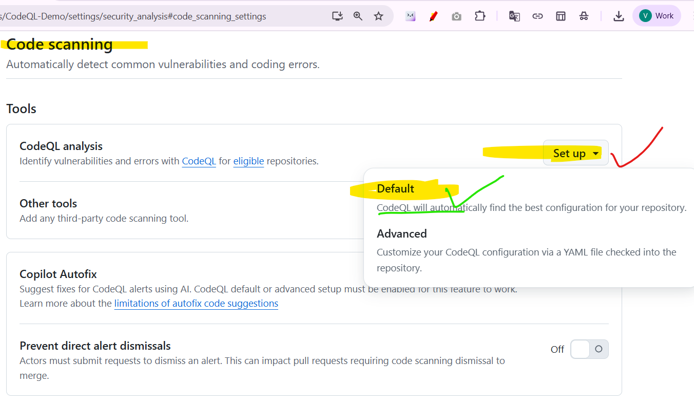
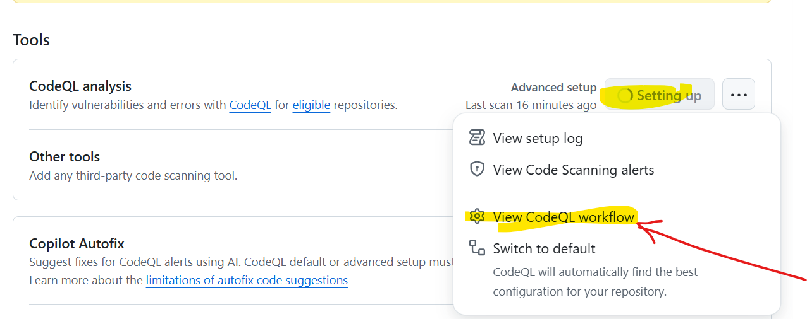

# CodeQL Demo — Visual Walkthrough

This short visual walkthrough shows the typical CodeQL setup and scanning flow for this repository.

---

## Step 1: Enable GitHub Advanced Security

## Step 2: Enable Code Scanning Alerts

## Step 3: Set Up Code Scanning

## Step 4: Configure Code Scanning

## Step 5: Enable Default Configuration

## Step 6: Confirm Default Setup

## Step 7: Commit CodeQL Workflow

## Step 8: CodeQL Analysis & Configuration

## Step 9: View Scanning Alerts

## Step 10: Advanced Configuration Options

---

## Summary

This walkthrough demonstrates the complete process of enabling and configuring GitHub Advanced Security with CodeQL scanning, from initial setup to viewing security alerts.